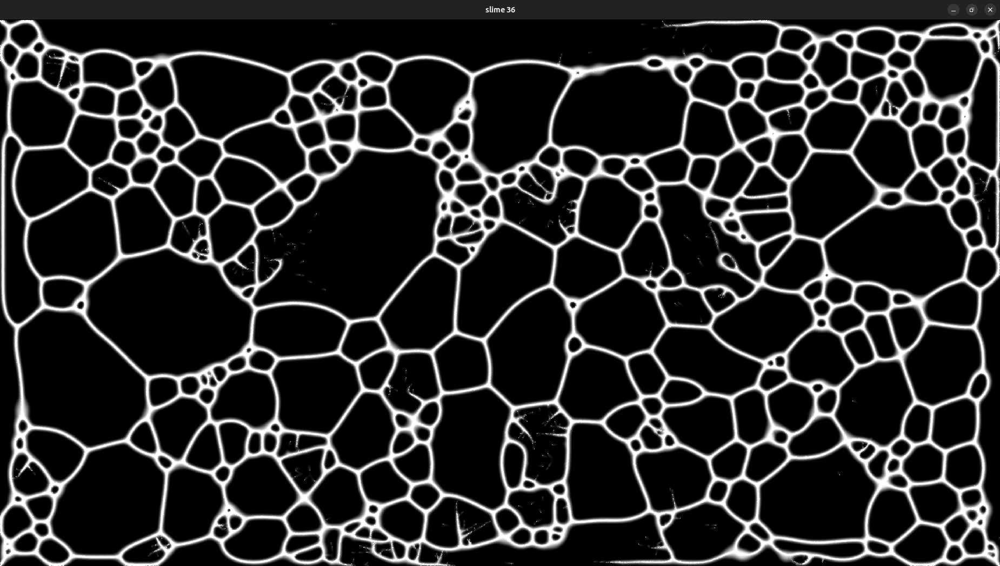

# Slime renderer

Slime renderer uses particles with simple behaviors to create complicated patters. The particles leave trails. Based on the picture generated the particles decide where to go on the next frame. The particles are calculated on CUDA kernels.

## Dependencies

To complile this program you need to:

- Install g++, make and nvcc
- Download Glad of your liking from glad.dav1d.de:
	- Lan: C/C++
	- Spec: OpenGL
	- Profile: Core 
	- gl: OpenGL version
	- Generate loader: yes
	- Extract it to lib/
- Install GLFW 3
	- On Ubuntu install libglfw3 and libglfw3-dev
- Install glm
	- On Ubuntu install libglm-dev
